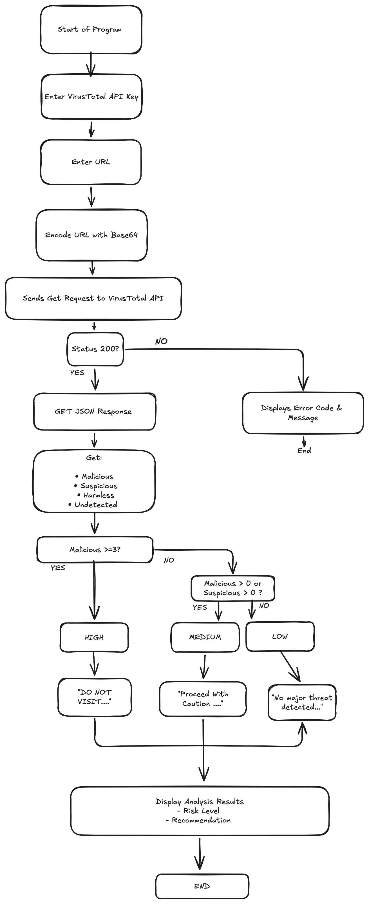

# Virus Total Risk Analyzer
A Python based cybersecurity project that uses a VirusTotal API to analyze URLs and provides a risk assessment and security recommendation.

## How it works
This program allows the user to enter a URL and analyze it via a VirusTotal API. It displays the number of malicious, suspicious, harmless, and undetected results reported by security vendors and provides a risk level assessment and recommendation. 



## Features 
- Accepts an API key from the user
- Accepts a URL from the user
- Uses the VirusTotal API to retrieve URL analysis results
- Displays the number of malicious, suspicious, harmless, and undetected results
- Reports how many security vendors flagged the URL as malicious or suspicious
- Assigns a risk level based on the analysis
- Provides a recommendation based on calculated risk level
- Handles API errors and unsuccessful requests

## Risk Assessment
This is how I distinguished a high/med/low risk level. 

| Risk Level | Condition | Recommendation | 
|---|---|---|
| Low| 0 malicious and 0 suspicious| No significant threats detected. Continue with normal caution.|
| Medium| 1-2 malicious or 1+ suspicious|Proceed with caution. Avoid entering sensitive information.|
| High | 3+ malicious | Do not visit the URL or enter sensitive information. |

## Example Output 

Low Risk:
```
Please enter your VirusTotal API key: ###############################
Please enter the url you'd like to analyze: https://www.####.com

https://www.####.com Analysis Completed.

Analysis Results:
Malicious: 0
Suspicious: 0
Harmless: 60
Undetected: 32

Risk Level: LOW
Reason: No malicious or suspicious detections were reported.
Recommendation: No significant threats were detected. Continue to use normal caution.

Process finished with exit code 0

```

High Risk: 
```
Please enter your VirusTotal API key: ###############################
Please enter the url you'd like to analyze: http://####.org

http://####.org Analysis Completed.

Analysis Results:
Malicious: 3
Suspicious: 2
Harmless: 57
Undetected: 30
3 security vendors flagged this URL as malicious.
2 security vendors flagged this URL as suspicious.

Risk Level: HIGH
Reason: The number of malicious detections meets the threshold for a high risk classification.
Recommendation: Do not visit this URL or enter any sensitive information.
```

## Technologies Used
- Python
- VirusTotal API
- Requests library
- Base64
- JSON

## What I Learned 
Throughout this project I was able to learn and further develop my skills in... 
- Working with REST APIs
- Sending GET requests using the Requests library
- Working with JSON responses and nested dictionaries
- Base64 encoding to create a VirusTotal URL ID
- Use of conditional statements to interpret API results
- How cybersecurity tools can be integrated into Python projects
- API authentication

## Future Improvements 
- Add a web interface
- Improve risk scoring methodology
- Add domain registration and DNS information, such as IP addresses, registrars, etc...
- Develop a browser extension that users can use to analyze links while browsing 

## Disclaimer 
This project is intended for educational purposes. Risk results and recommendations do not guarantee that a URL is completely safe and may require further investigation before taking action.
